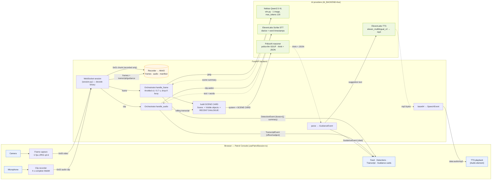

# JARVIS — live data flow

How a live patrol session flows through the system in `AI_BACKEND=live`. Solid arrows are
forward/requests; dotted arrows are responses. Green = AI providers, blue = browser I/O,
orange = object storage.

## The three paths

- **Vision / VLM** — `Camera → frame capture (~2 fps) → 0x00 → handle_frame` (throttled ≤1 / 0.7 s) `→ Nebius Qwen2.5-VL` captions one JPEG → scene summary returns → `DetectionEvent` to the UI.
- **Speech-to-Text** — `Mic → 4 s complete WebM clip → 0x02 → handle_audio → ElevenLabs Scribe` (diarized, word timestamps) → text + words return → appended to the rolling transcript and labelled `officer`/`subject` → `TranscriptEvent` to the UI.
- **Reasoning + Text-to-Speech** — the scene summary and rolling transcript build a **SCENE CARD** → the fine-tuned **PoliceAI** model (`police-llm`) returns `<think>` + JSON → parsed into a cited `GuidanceEvent` → its suggestion is sent to **ElevenLabs TTS** → mp3 → `SpeechEvent` → played in the browser.

> Continuous `0x01` audio fragments are stored for the recorded track only — **not** transcribed; only the self-contained `0x02` clips hit STT. Every frame, transcript, and guidance event is also persisted to MinIO regardless of backend.
