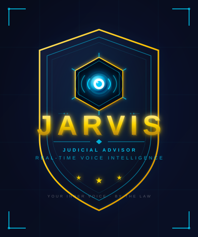
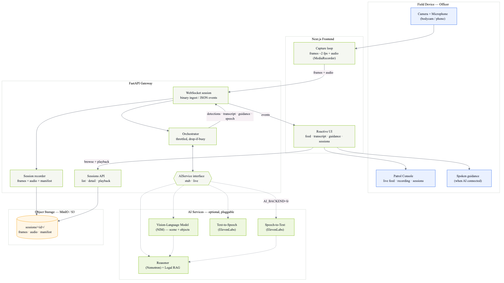

<!-- _class: lead -->
<!-- _footer: "" -->
<!-- _paginate: false -->

#### A real-time, on-device legal & de-escalation copilot for frontline officers

**NVIDIA Impact Hackathon** · runs locally on **DGX Spark**

> Assistive and human-in-the-loop. It cites the law; it never decides.

---

## The problem

Officers make **split-second legal decisions** under stress:

- *Do I have grounds to search? What must I say first?*
- *Is arrest necessary, or is there a lesser option?*
- *Which rights are engaged right now?*

Get it wrong and the cost is real: **unlawful stops, avoidable escalation, evidence thrown out, lost public trust.**

Today, body-worn video is **review-only** — it tells you what went wrong *after* the encounter. There is **no real-time copilot** that reads the scene *and* the law in the moment.

---

## What we built

A live body-cam feed (**video + audio**) streams to a local pipeline that:

1. **Sees** the scene — vision model describes people, objects, actions
2. **Hears** the conversation — speech-to-text, with **who-said-what** (officer vs. subject)
3. **Reasons** over **real England & Wales law** — emits **cited, de-escalation-focused guidance**
4. **Speaks** it back — hands-free audio for the officer
5. **Records everything** — tamper-evident audit log + replayable MP4 with synced transcript

Built to run **entirely on a DGX Spark** — body-cam footage and PII **never leave the device**.

> **JARVIS** = *Patrol Assist* (the real-time system) + *PoliceAI* (the fine-tuned, law-grounded model).

---

## Demo flow

1. **Onboard** the officer — record a ~7 s voice sample (enrolls a local voice embedding)
2. **Start patrol** — camera + mic stream over a binary WebSocket at ~2 fps
3. Live **detections + transcript** appear; transcript is tagged `officer` / `subject` in real time
4. A **cited guidance card** surfaces (legal basis · suggested action · tone · rights · next steps) and is **read aloud**
5. **Stop** — the session is encoded to MP4 and stored; a background pass **diarizes** the audio for clean playback

> Every input, model output, and officer action is written to an append-only session manifest.

---

## Architecture

**Field device → Next.js console → FastAPI orchestrator → pluggable AI layer → reactive UI + TTS**, with every session persisted to object storage (MinIO/S3).

The AI layer is an **interface** (`AIService`): swap `stub` → `live` to change the intelligence without touching the UI.

---

## Technical depth — this is a system, not a wrapper

**1 · Legal-reasoning dataset pipeline** *(built)*
Built on real, openly-licensed England & Wales law: [legislation.gov.uk](https://www.legislation.gov.uk) · [Find Case Law — The National Archives](https://caselaw.nationalarchives.gov.uk) · [PACE Codes](https://www.gov.uk/guidance/police-and-criminal-evidence-act-1984-pace-codes-of-practice).
`citation-tagged corpus → BM25 retrieval → SCENE-CARD examples (<think> + JSON) → validate`
Every citation is **cross-checked back against the corpus**. Hard checks reject US-law leakage, guilt opinions, and schema violations.

**2 · Fine-tuned an NVIDIA model** *(trained)*
QLoRA on **Nemotron-Super-49B** → merged → **GGUF Q4_K_M** for local serving.

**3 · Real-time orchestrator** *(built)*
Throttled **drop-if-busy** loop (≤1 analysis / 0.7 s) keeps latency bounded under load — the realtime path never queues up.

**4 · Local inference services** *(built)*
Self-hosted **vLLM** (video) + **llama.cpp** (the fine-tuned LLM), both OpenAI-compatible, containerized for Spark.

---

## NVIDIA ecosystem & the Spark story

**We did not just call a cloud LLM — we fine-tuned and serve an NVIDIA model locally.**

| NVIDIA piece | How we use it |
|---|---|
| **Nemotron-Super-49B** | Fine-tuned with QLoRA to become *PoliceAI* — reasoning + structured output |
| **DGX Spark (GB10 Grace Blackwell)** | Training + inference target; **128 GB unified memory** |
| **FP4 on 5th-gen Tensor Cores** | Native 4-bit → fine-tune a 49B model in **~38 GB** |
| **NVIDIA vLLM container** (`nvcr.io`) | Serves the local vision model |
| **NIM / Nemotron API** | Pluggable cloud reasoning backend |

---

## Why Spark, specifically

**Unified memory.** 128 GB holds the **49B model + KV cache + video-frame buffer + speaker embeddings simultaneously** — no sharding, no juggling a 24 GB discrete GPU.

**Privacy.** Local inference means evidence-grade body-cam data and PII stay on the device — essential for policing and the chain of custody.

**Latency.** On-device guidance during a live encounter — no round-trip to a cloud API.

> *"Merely calling GPT-4 via API gets 0 points." We fine-tuned an NVIDIA model and run it locally.*

---

## Value & impact

**Insight quality — situation-specific, not generic.** A dashboard says *"crime rises at night."* JARVIS reasons about the actual scene and **cites the law**:

| Field | Guidance (validated against the corpus) |
|---|---|
| **Scene** | strong smell of cannabis · hands in pockets · 2-yr officer · night |
| **Legal basis** | s.23(2) Misuse of Drugs Act 1971 — reasonable grounds to search |
| **Say first** | all GOWISELY elements (PACE Code A 3.8) |
| **Rights** | street search, *not* arrest — Code C custody rights not yet engaged |
| **De-escalation** | answer "why am I stopped?" directly; speak slowly |

*Actual model output — every citation is validated back against the scraped corpus, not invented.*

**Usability — a tool an officer could use tomorrow.**
- Officer: **hands-free** audio guidance, human-in-the-loop — nothing decided for them.
- Supervisor / legal reviewer: **replayable MP4 + synced transcript + guidance log** per session.

---

## Innovation & execution

**Creativity — combine modalities that aren't usually combined:**
- **Vision** (scene understanding) **+ speaker diarization** (officer vs. subject) **+ legal RAG reasoning + voice** — the system *reads the scene and the law together*, in real time.
- **Anti-hallucination by construction:** the model is trained to cite **only** retrieved law, and a validator drops any record whose citations don't trace back to the corpus.

**Performance & engineering:**
- **Drop-if-busy** throttling → bounded real-time latency.
- **FP16 QLoRA** → 49B fine-tune fits in ~98 GB.
- **Quantized GGUF** local serving via llama.cpp.
- Local **resemblyzer** voice embeddings → speaker labels with **no API call**.

---

## Roadmap & the ask

**Beyond the hack:**
- Expand the corpus + dataset (more incident types, force-policy packs).
- Per-force fine-tunes; on-device continuous learning from reviewed sessions.
- Field trial with a human-in-the-loop supervisor dashboard.

**The ask:** a DGX Spark in the loop turns this from a privacy-respecting prototype into something a real patrol could use **tomorrow**.

> **JARVIS** — it reads the scene, cites the law, and keeps the human in command.

---

<!-- _class: lead -->
<!-- _footer: "" -->
<!-- _paginate: false -->

# Appendix

Technical detail for Q&A

---

## Appendix · Data + fine-tuning pipeline

**Sources (all openly licensed):** legislation.gov.uk (CLML XML), Find Case Law / The National Archives (LegalDocML), curated PACE Codes A/C/G.
Statutes incl. PACE 1984, MDA 1971, CJPOA 1994 (s.60), RTA 1988, POA 1986, HRA 1998, MHA 1983.

**Generation:** 16 incident types × officer queries → deterministic **SCENE CARDs** → **BM25 retrieval** (top-8, with a *guidance floor* that always keeps PACE-Code slots) → Claude produces `<think>` + 6-key JSON.

**Validation (hard):** exact system prompt · `<think>` present · JSON schema (`escalation_risk ∈ {low,med,high}`, ≥2 `next_steps`) · **no US law** · **no guilt opinion** · **citation grounding** · dedupe. → **98 records (88 train / 10 val)**.

**Fine-tune:** Nemotron-Super-49B · QLoRA (r=16, α=32, FP4 base + BF16 adapters) · 3 epochs · LR 2e-4 · seq 4096 · `transformers/trl/peft/bitsandbytes` · merge → GGUF **Q4_K_M**.

---

## Appendix · Real-time system internals

**Capture (browser):** ~2 fps JPEG (q0.6); audio as 1 s continuous fragments + 4 s STT clips; **binary WebSocket** (1-byte kind + timestamp + dims + payload).

**Orchestrator:** `analyze` at most once / **0.7 s**, **drop-if-busy**; keeps last 2 000 chars of transcript as reasoning context; emits Detection / Transcript / Guidance / Speech events.

**Speaker ID:** local **resemblyzer** d-vectors, **0.70** cosine threshold for live officer/subject; post-session **ElevenLabs Scribe diarization** relabels `officer / person1 / person2…`.

**Recording:** frames + audio + events → **MinIO** (`sessions/{id}/…`); **ffmpeg** concat → **H.264/AAC MP4**; manifest drives synced playback.

**Local services:** `llava-video-to-text` — vLLM serving **LLaVA-1.6-Mistral-7B** (port 8900); `police-llm` — **llama.cpp** serving the fine-tuned **Nemotron GGUF** (OpenAI-compatible, port 8000). `src/video_to_text.py` — remote **Qwen2.5-VL** (Nebius) dev/fallback path.
