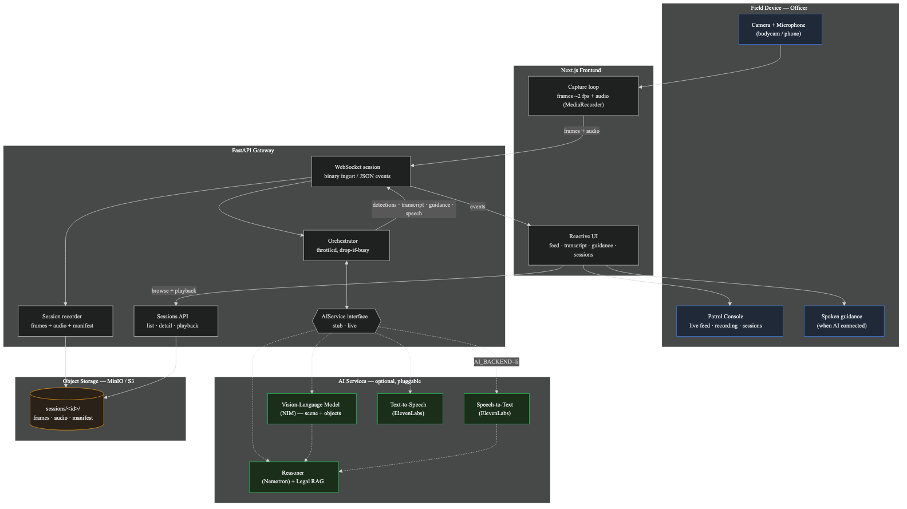

# Architecture

The **intended** end-to-end system. Components built today are marked below; the rest are planned.
See the [root README](../README.md) for setup and the `AI_BACKEND` modes.



> Source: [architecture.mmd](architecture.mmd) (Mermaid). Regenerate the image with:
> ```bash
> npx -y @mermaid-js/mermaid-cli -i docs/architecture.mmd -o docs/architecture.png -b transparent -w 1600
> ```

## Flow

1. **Field device** — the officer's camera + microphone feed the Next.js console.
2. **Frontend** samples frames (~2 fps) and audio and streams them over a WebSocket.
3. **FastAPI gateway** runs a throttled, drop-if-busy orchestrator. All model work goes through
   the **`AIService` interface**, which swaps between a deterministic stub and live providers.
4. **AI services** — ElevenLabs STT, NVIDIA NIM VLM, Nemotron reasoning over a legal RAG corpus,
   ElevenLabs TTS. The reasoner emits **cited, law-aligned guidance** — never directives.
5. Events (detections, transcript, guidance, speech) stream back to the reactive UI and TTS.
6. Every input, model output, and officer action is written to an **append-only audit log**.
   Incidents produce **reports** dispatched via **webhooks** to logs / report store / cop registry.

## Build status by component

| Component | Status |
|-----------|--------|
| Frontend capture + reactive UI | ✅ Built |
| WebSocket session + orchestrator | ✅ Built |
| Session recording → MinIO (frames + audio + manifest) | ✅ Built |
| Sessions API (list / detail / rename / delete) | ✅ Built |
| Session playback — MP4 encode (ffmpeg) + synced logs | ✅ Built |
| `AIService` interface (stub default · live pluggable) | ✅ Built |
| ElevenLabs speech-to-text + text-to-speech | ✅ Built |
| Fine-tuned PoliceAI reasoner (SCENE CARD prompt → cited guidance) | ✅ Built |
| Incident reports + webhooks → logs / report store / cop registry | ✅ Built |
| NVIDIA VLM scene understanding + detections | Planned (separate PR) |
| Legal RAG fallback for the reasoner | Planned |
